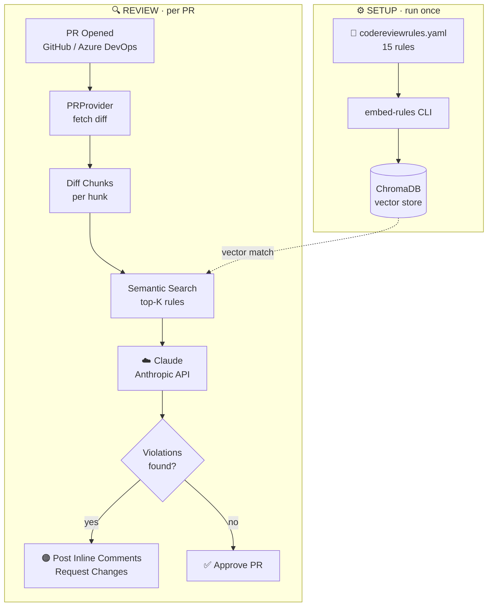

# ai-pr-reviewer

> **AI-powered, DevOps-agnostic pull request reviewer.**  
> Define your rules in YAML. Embed them in ChromaDB. Let Claude review your PRs.

[](https://python.org)
[](https://anthropic.com)
[](https://trychroma.com)
[](LICENSE)

---

## The Problem

Every team has code review standards — security practices, performance patterns, design principles — but enforcing them consistently across PRs is expensive and slow. Human reviewers get fatigued, inconsistent, or miss things under deadline pressure.

**ai-pr-reviewer** automates the first pass. It encodes your rules in a YAML file, embeds them into a vector database (ChromaDB), and uses Claude to semantically match rules to each diff chunk — flagging real violations with actionable comments directly on the PR.

---

## How It Works



### Why ChromaDB?

Instead of sending **all** rules to the LLM on every PR (expensive, noisy), each rule is embedded as a vector. When a diff chunk arrives, it is embedded and the **semantically closest rules** are retrieved. A security rule only fires when the diff resembles a security concern. A performance rule only fires on code that looks performance-sensitive. This makes reviews fast, cheap, and targeted.

---

## Quick Start

### 1. Install dependencies

```bash
pip install -r requirements.txt
```

### 2. Set environment variables

```bash
# Required for all providers
export ANTHROPIC_API_KEY=sk-ant-...

# Azure DevOps
export ADO_ORG=my-org
export ADO_PROJECT=my-project
export ADO_REPO=my-repo
export ADO_TOKEN=<PAT with Code Read + PR Read/Write>

# GitHub (alternative)
export GITHUB_TOKEN=ghp_...
export GITHUB_OWNER=my-org
export GITHUB_REPO=my-repo
```

Or use a `.env` file — the CLI loads it automatically.

### 3. Embed your rules (one-time)

```bash
python -m src.cli embed-rules
# → ChromaDB now contains 15 embedded rules.
```

### 4. Review a PR

```bash
# Azure DevOps
python -m src.cli review --provider azure --pr-id 42

# GitHub
python -m src.cli review --provider github --pr-id 123
```

---

## Defining Rules

Rules live in `codereviewrules.yaml`. Add, edit, or remove rules anytime — re-run `embed-rules --force` to refresh ChromaDB.

```yaml
rules:
  - id: SEC-001
    name: No hardcoded credentials
    category: security
    severity: critical
    description: >
      Passwords, API keys, tokens, and secrets must never appear as string
      literals in source code. Use environment variables or a secrets manager.
    examples:
      violation: 'String apiKey = "sk-abc123";'
      compliant: 'String apiKey = System.getenv("API_KEY");'
    tags: [credentials, secrets, api-key]

  - id: PERF-001
    name: Avoid N+1 query patterns
    category: performance
    severity: high
    description: >
      Fetching child records inside a loop without batching causes N+1
      database queries. Use batch fetches or JOIN queries.
    tags: [database, hibernate, jpa, loop]
```

The included `codereviewrules.yaml` ships with 15 rules across:

| Category | Rules |
|---|---|
| 🔐 Security | Hardcoded credentials, SQL injection, input validation |
| ⚡ Performance | N+1 queries, connection pooling, caching, blocking calls |
| 🛡️ Resilience | Empty catch blocks, retry patterns, circuit breakers |
| 🏗️ Design | SRP, event-driven coupling, DTO separation |
| ✏️ Style | Logging, magic numbers |
| 🧪 Testing | Unit test coverage, Thread.sleep in tests |

---

## Architecture

```
ai-pr-reviewer/
├── codereviewrules.yaml          # Your rule definitions
├── requirements.txt
└── src/
    ├── rules/
    │   ├── loader.py             # Parse YAML → Rule dataclasses
    │   └── embedder.py           # (utility) batch embed rules
    ├── vector_store/
    │   └── chroma_store.py       # ChromaDB wrapper (embed + query)
    ├── providers/
    │   ├── base.py               # PRProvider abstract interface
    │   ├── azure_devops.py       # Azure DevOps REST API adapter
    │   └── github_provider.py    # GitHub REST API adapter
    ├── agent/
    │   ├── reviewer.py           # Core agent loop
    │   └── prompts.py            # System + review prompt templates
    └── cli.py                    # Click CLI entrypoint
```

### Adding a new platform

Implement `PRProvider` in a new file under `src/providers/`:

```python
class GitLabPRProvider(PRProvider):
    def get_metadata(self, pr_id: str) -> PRMetadata: ...
    def get_diff(self, pr_id: str) -> List[FileDiff]: ...
    def post_comments(self, pr_id: str, comments: List[ReviewComment]): ...
    def approve(self, pr_id: str): ...
    def request_changes(self, pr_id: str, summary: str): ...
```

The agent never imports platform-specific code — it only calls the interface.

---

## Example Review Output

```
🔴 [SEC-001] CRITICAL

API key is hardcoded as a string literal on this line. This will be
committed to version history and may be exposed in logs or error messages.
Use System.getenv("API_KEY") or your secrets manager instead.

---

🟠 [PERF-001] HIGH

orderRepo.findByUserId() is called inside a loop over a list of users.
This causes N+1 database queries. Refactor to use
orderRepo.findByUserIdIn(userIds) to fetch all orders in a single query.
```

---

## CI / CD Integration

### Azure DevOps Pipeline

```yaml
trigger:
  - none

pr:
  branches:
    include: ['*']

pool:
  vmImage: ubuntu-latest

steps:
  - script: pip install -r requirements.txt
    displayName: Install dependencies

  - script: python -m src.cli embed-rules
    displayName: Embed rules
    env:
      ANTHROPIC_API_KEY: $(ANTHROPIC_API_KEY)

  - script: python -m src.cli review --provider azure --pr-id $(System.PullRequest.PullRequestId)
    displayName: AI Code Review
    env:
      ANTHROPIC_API_KEY: $(ANTHROPIC_API_KEY)
      ADO_ORG: $(System.TeamFoundationCollectionUri)
      ADO_PROJECT: $(System.TeamProject)
      ADO_REPO: $(Build.Repository.Name)
      ADO_TOKEN: $(System.AccessToken)
```

### GitHub Actions

```yaml
on:
  pull_request:
    types: [opened, synchronize]

jobs:
  ai-review:
    runs-on: ubuntu-latest
    steps:
      - uses: actions/checkout@v4
      - run: pip install -r requirements.txt
      - run: python -m src.cli embed-rules
      - run: python -m src.cli review --provider github --pr-id ${{ github.event.pull_request.number }}
        env:
          ANTHROPIC_API_KEY: ${{ secrets.ANTHROPIC_API_KEY }}
          GITHUB_TOKEN: ${{ secrets.GITHUB_TOKEN }}
          GITHUB_OWNER: ${{ github.repository_owner }}
          GITHUB_REPO: ${{ github.event.repository.name }}
```

---

## Roadmap

- [x] `v1.0` — Core agent, ChromaDB RAG pipeline, Azure DevOps + GitHub adapters
- [ ] `v1.1` — GitLab adapter
- [ ] `v1.2` — Webhook server mode (auto-trigger on PR open)
- [ ] `v1.3` — Rule suggestion mode (Claude proposes new rules from PR history)
- [ ] `v2.0` — Multi-language rule sets (Python, TypeScript, Go)
- [ ] `v2.1` — Rule effectiveness analytics (which rules fire most, false positive rate)

---

## License

MIT © Kamlesh
